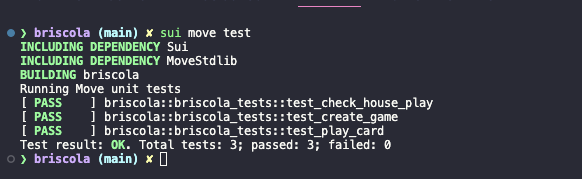

# Single Player Briscola on Sui Move

A simple implementation of the classic Italian card game Briscola, built using the Move programming language on the Sui blockchain. This project serves as an experimental playground for learning Move development.

## About Briscola

Briscola is a traditional Italian card game played with a 40-card Italian deck. In this implementation, it's simplified to a single-player version where the player competes against the house (computer).

## Game Features

- Single-player gameplay against the house
- Traditional Italian deck simulation (40 cards)
- Standard Briscola scoring system
- Trump card mechanics
- Automatic house plays
- Complete game state tracking

## Technical Implementation

The game is implemented as a Move module on the Sui blockchain, featuring:

- Full game state management
- Event emission for game actions
- Pseudo-random card shuffling
- Automated house play logic
- Score tracking and winner determination

## Game Rules

1. Each player receives 3 cards
2. One card is drawn as the trump suit
3. Players take turns playing cards
4. The winner of each trick:
   - Collects the points from both cards
   - Draws a new card first (if available)
   - Leads the next trick
5. Game ends when all cards are played
6. Player with the most points wins

## Card Points

- Ace: 11 points
- Three: 10 points
- King: 4 points
- Knight: 3 points
- Jack: 2 points
- All other cards: 0 points

## Purpose

This project was created primarily as a learning exercise to:

- Understand Move language syntax and patterns
- Explore Sui blockchain development
- Implement game logic in a blockchain context
- Practice handling game state and events

## Devnet Contract Address

The devnet contract is deployed at:

`0x434a19b0a4cd06afd4d36ee3d60ea0793a334d294c3419c97ad966f706524157`

## Setup and Installation

### Prerequisites

1. Install Sui by following the official guide: [Install Sui to Build](https://docs.sui.io/guides/developer/getting-started/sui-install)
2. Make sure you have Git installed on your system

### Project Setup

1. Clone the repository & cd sui-briscola
2. sui move build

### Run Tests

sui move test

## Note

This is a simplified version of Briscola and is intended for educational purposes. It serves as a demonstration of Move language capabilities rather than a full-featured game implementation.
